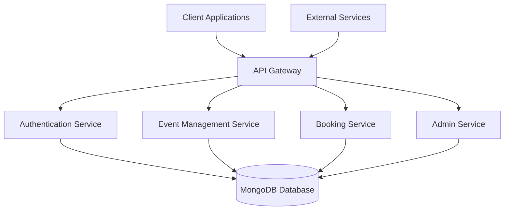

# EventEase Backend

EventEase is a comprehensive event management system that allows users to create, manage, and book events seamlessly.

## System Design



## Features

- User Authentication (Registration & Login)
- Event Creation and Management
- Event Booking System
- Admin Dashboard
- RESTful API

## Tech Stack

- **Backend**: Node.js, Express.js
- **Database**: MongoDB with Mongoose
- **Authentication**: JWT (JSON Web Tokens)
- **Environment Management**: `dotenv`
- **Logging**: Morgan
- **Security**: CORS, `bcryptJS`

## Prerequisites

- Node.js v14 or higher
- MongoDB database (local or cloud instance)

## Installation

1. Clone the repository:

   ```bash
   git clone <repository-url>
   ```

2. Navigate to the backend directory:

   ```bash
   cd eventease-backend
   ```

3. Install dependencies:

   ```bash
   npm install
   ```

4. Create a `.env` file in the root directory with the following variables:

   ```
   PORT=5000
   MONGO_URI=your_mongodb_connection_string
   JWT_SECRET=your_jwt_secret_key
   ```

5. Start the development server:

   ```bash
   npm run dev
   ```

   Or for production:

   ```bash
   npm start
   ```

## API Endpoints

### Authentication

- `POST /api/auth/register` - Register a new user
- `POST /api/auth/login` - Login user

### Events

- `GET /api/events` - Get all events
- `GET /api/events/:id` - Get event by ID
- `POST /api/events` - Create a new event (Admin only)
- `PUT /api/events/:id` - Update event (Admin only)
- `DELETE /api/events/:id` - Delete event (Admin only)

### Bookings

- `GET /api/bookings` - Get all bookings (Admin only)
- `GET /api/bookings/my-bookings` - Get current user's bookings
- `POST /api/bookings` - Create a new booking
- `DELETE /api/bookings/:id` - Cancel booking

### Admin

- `GET /api/admin/users` - Get all users (Admin only)
- `DELETE /api/admin/users/:id` - Delete user (Admin only)

## Project Structure

```
src/
├── config/          # Database and other configurations
├── controllers/     # Request handlers
├── middlewares/     # Custom middleware functions
├── models/          # Database models
├── routes/          # API route definitions
├── utils/           # Utility functions
└── index.js         # Entry point
```

## Environment Variables

| Variable   | Description                      | Required |
| ---------- | -------------------------------- | -------- |
| PORT       | Server port number               | Yes      |
| MONGO_URI  | MongoDB connection string        | Yes      |
| JWT_SECRET | Secret key for JWT token signing | Yes      |

## Contributing

1. Fork the repository
2. Create your feature branch (`git checkout -b feature/AmazingFeature`)
3. Commit your changes (`git commit -m 'Add some AmazingFeature'`)
4. Push to the branch (`git push origin feature/AmazingFeature`)
5. Open a pull request

## License

This project is licensed under the MIT License.
