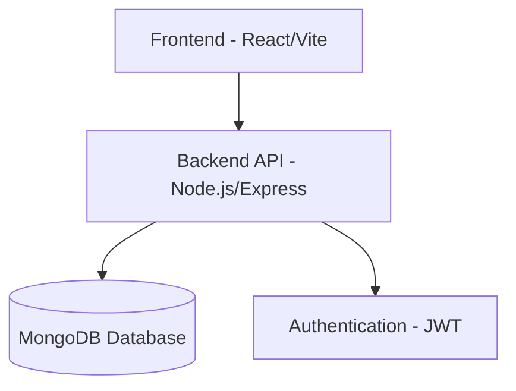

# Event-Ease Bookings

Event-Ease is a comprehensive event management system that allows users to browse, create, manage, and book events seamlessly. The platform consists of a React frontend with a Node.js/Express backend, utilizing MongoDB for data storage.

## Table of Contents

- [Project Overview](#project-overview)
- [System Architecture](#system-architecture)
- [Tech Stack](#tech-stack)
- [Features](#features)
- [Project Structure](#project-structure)
- [Prerequisites](#prerequisites)
- [Installation](#installation)
- [Environment Configuration](#environment-configuration)
- [Running the Application](#running-the-application)
- [API Endpoints](#api-endpoints)
- [Deployment](#deployment)

## Project Overview

Event-Ease provides a complete solution for event management with distinct roles for regular users and administrators. Users can browse events, make bookings, and manage their reservations, while administrators can create, update, and manage events and users.

## System Architecture



## Tech Stack

### Backend

- **Runtime**: Node.js
- **Framework**: Express.js
- **Database**: MongoDB with Mongoose ODM
- **Authentication**: JWT (JSON Web Tokens)
- **Validation**: Built-in validation with Mongoose
- **Environment Management**: Environment variable loader
- **Logging**: HTTP request logging middleware
- **Security**: Password hashing library, Cross-Origin Resource Sharing support
- **Development**: Auto-restart development server

### Frontend

- **Framework**: React 18 with TypeScript
- **Build Tool**: Modern frontend build tool
- **Routing**: Declarative routing for React applications
- **State Management**: Predictable state container
- **Data Fetching**: Server state management library
- **UI Components**: Accessible UI component library
- **Styling**: Utility-first CSS framework
- **Form Handling**: Performant, flexible forms with easy validation
- **Icons**: Beautifully crafted SVG icons
- **Date Utilities**: Modern JavaScript date utility library
- **HTTP Client**: Promise based HTTP client

## Features

### User Features

- User registration and authentication
- Browse and search events
- View event details
- Book events
- Manage personal bookings
- User dashboard

### Admin Features

- Full event management (CRUD operations)
- User management
- View all bookings
- Admin dashboard

### Security

- JWT-based authentication
- Password encryption using secure hashing algorithms
- Role-based access control
- Protected routes

## Project Structure

```
event-ease-bookings/
├── Backend/
│   ├── src/
│   │   ├── config/          # Database and other configurations
│   │   ├── controllers/     # Request handlers
│   │   ├── middlewares/     # Custom middleware functions
│   │   ├── models/          # Database models
│   │   ├── routes/          # API route definitions
│   │   ├── utils/           # Utility functions
│   │   └── index.js         # Entry point
│   ├── .env                 # Environment variables
│   └── package.json         # Backend dependencies
└── Frontend/
    ├── src/
    │   ├── components/      # Reusable UI components
    │   ├── hooks/           # Custom React hooks
    │   ├── lib/             # Utility functions
    │   ├── pages/           # Page components
    │   ├── services/        # API service layer
    │   ├── store/           # Redux store and slices
    │   ├── types/           # TypeScript types
    │   ├── utils/           # Helper functions
    │   ├── App.tsx          # Main App component
    │   └── main.tsx         # Entry point
    ├── package.json         # Frontend dependencies
    └── vite.config.ts       # Vite configuration
```

## Prerequisites

- Node.js v14 or higher
- Node package manager or similar package management tool
- MongoDB database (local or cloud instance)
- Git (for cloning the repository)

## Installation

1. Clone the repository:

   ```bash
   git clone <repository-url>
   cd event-ease-bookings
   ```

2. Install backend dependencies:

   ```bash
   cd Backend
   npm install
   cd ..
   ```

3. Install frontend dependencies:
   ```bash
   cd Frontend
   npm install
   cd ..
   ```

## Environment Configuration

### Backend (.env file in Backend directory)

Create a `.env` file in the Backend directory with the following variables:

```env
PORT=5000
MONGO_URI=your_mongodb_connection_string
JWT_SECRET=your_jwt_secret_key
```

### Frontend (Build tool environment)

The frontend runs on port 8080 by default (configured in the build configuration file).

## Running the Application

### Backend

```bash
# Development mode with hot reloading
cd Backend
npm run dev

# Production mode
npm start
```

### Frontend

```bash
# Development mode with hot reloading
cd Frontend
npm run dev

# Production build
npm run build

# Preview production build
npm run preview
```

To run both frontend and backend concurrently, you'll need to run each in separate terminal sessions.

## API Endpoints

### Authentication

- `POST /api/auth/register` - Register a new user
- `POST /api/auth/login` - Login user

### Events

- `GET /api/events` - Get all events
- `GET /api/events/:id` - Get event by ID
- `POST /api/events` - Create a new event (Admin only)
- `PUT /api/events/:id` - Update event (Admin only)
- `DELETE /api/events/:id` - Delete event (Admin only)

### Bookings

- `GET /api/bookings` - Get all bookings (Admin only)
- `GET /api/bookings/my-bookings` - Get current user's bookings
- `POST /api/bookings` - Create a new booking
- `DELETE /api/bookings/:id` - Cancel booking

### Admin

- `GET /api/admin/users` - Get all users (Admin only)
- `DELETE /api/admin/users/:id` - Delete user (Admin only)

## Deployment

### Backend

1. Set up a MongoDB database (MongoDB Atlas recommended for cloud deployments)
2. Configure environment variables on your deployment platform
3. Deploy the Backend directory to your preferred Node.js hosting platform (Heroku, Render, DigitalOcean, etc.)

### Frontend

1. Build the production version:
   ```bash
   cd Frontend
   npm run build
   ```
2. Deploy the generated `dist/` folder to any static hosting service (Netlify, cloud hosting platforms, GitHub Pages, etc.)

Ensure that the frontend is configured to communicate with the deployed backend API endpoint.
